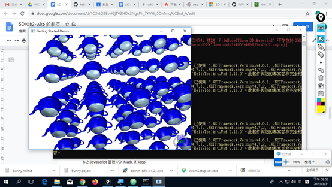

## csjouhwu.github.io
### SD1082 2020/6/17
## 第1週課程摘記(asp.net core/atom/docker / Console/ Web/UseUrls/Mobile)
### wk0101 CS 基本架構
dotnet new console -o wk0101  
cd wk0101  
dotnet run  

### wk0102 CS Web 程式架構
dotnet new web -o wk0102 
cd wk0102  
dotnet run  
chrome https://localhost:5001/ 

### wk0103.html VR 基本架構
https://aframe.io 
### wk0104 Docker Hello world
https://hub.docker.com/_/hello-world  
docker run hello-world 
docker images 

## 第2週課程摘記(Review Wk1 atom/asp.net core/ aframe.io mobile/ C# I/O)
### wk0201 CS 基礎 (I/O)
namespace xx  
{ 
  class oo 
  { 
    static void Main() 
    { 
      ...  
    } 
  } 
} 

## 第3週課程摘記(C# 基礎：for/ if /Winforms)
### wk0302 CS 基礎 (for)

### wk0303 CS Form app
dotnet new WinForms -o wk0303 

## 第4週課程摘記(C# WinForms/Button/for loop/if)
### wk0401 Form app step by step class/object/for/if
dotnet new WinForms -o wk0401 
button class 

position 
double loop 
5x5 button 

## 第5週課程摘記(WPF/for loop/button/helixtoolkit 3D/teapot)
### wk0501B WPF xaml
### wk0501 WPF app step by step class/object/for/if
dotnet new WPF -o wk0501 
button class 
position 
double loop 
5x5 button 

### wk0502 wpf VR external library helixtoolkit.wpf
https://github.com/helix-toolkit/helix-toolkit/wiki/Getting-started-with-WPF-3D
https://www.nuget.org/packages/HelixToolkit.Wpf/
https://docs.microsoft.com/en-us/dotnet/framework/wpf/graphics-multimedia/how-to-apply-multiple-transformations-to-a-3-d-model

## 第6週課程摘記(WPF xaml vs C# / tripple loop)
### wk0601 WPF xaml Transform
### wk0602 WPF xaml vs CS + loop
5x5x5 cube helixtoolkit 

### wk0603 WPF 3D from obj files

## 第7週課程摘記(WPF FileModelVisual3D/DefaultMaterial/xaml vs C#)
### wk0701 WPF 3D DefaultMaterial

### wk0702 WPF 3D DefaultMaterial
### wk0703 WPF 3D xaml vs CS

## 第8週課程摘記(web/html/aframe)
### wk0801 dotnet new web -o wk0801
### wk0802 html basic
### wk0803 aframe basic
## 第9週期中考試摘記(a-obj-model/tag vs javascript)
### wk0901 3d obj tag
### wk0802 3d obj tag vs javascript
## 第10週課程摘記(github account/username.github.io project/skin files of mtl)
### github account
### wk1001 3d mtl files settings
### wk1002 mtl files vs brushes
## 第11週課程摘記(docker/nginx)
### 11-1 docker nginx
https://blog.techbridge.cc/2018/03/17/docker-build-nginx-tutorial/ 
cmd 
docker run -d -p 7777:80 --name webserver nginx 
### 11-4 multiple containers
docker --version  
docker run -d -p 7777:80 --name webserver nginx 
docker run -d -p 8888:80 --name webserver2 nginx 
docker ps 
docker cp wk0802.html 3ef:/usr/share/nginx/html/wk0802.html 
docker cp wk0803.html 46f:/usr/share/nginx/html/wk0803.html 
## 第12週課程摘記(Razor C#/loop/staticfiles/asp.net sample container)
### 12-1 Razor
dotnet new razor -o wk1201  
copy static files into wwwroot 
### 12-2 Razor Container example
docker run -it --rm -p 8000:80 --name aspnetcore_sample mcr.microsoft.com/dotnet/core/samples:aspnetapp 
copy static files into wwwroot 
## 第13週課程摘記(Razor C#/Page 3/marquee)
### 13-1 Razor Page3 架構
## 第14週課程摘記(Razor+aframe/C# string skill/C# vs javascript)
### 14-1 Page4 html
### 14-2 Page5 step by step html + javascript vs CS
## 第15週課程摘記(Razor+aframe/re-write report)
### 15-1 Page6 step by step Razor + aframe
### 15-2 wwwroot
### 15-3 index.html tag vs javascript
## 第16週課程摘記(SPA bootstrap/html a/javascript html-a/drv.tw + qrcode)
### 16-1 goolge driver www.sd1082.io drv.tw
### 16-2 qrcode generator online
### 16-3 upload wwwroot into www.sd1082.io
### 16-4 qrcode scan
## 第17週課程摘記(SPA bootstrap index.html)
### 17-1 img tag src setAttribute
### 17-2 href = id
### drv.tw + qrcode
